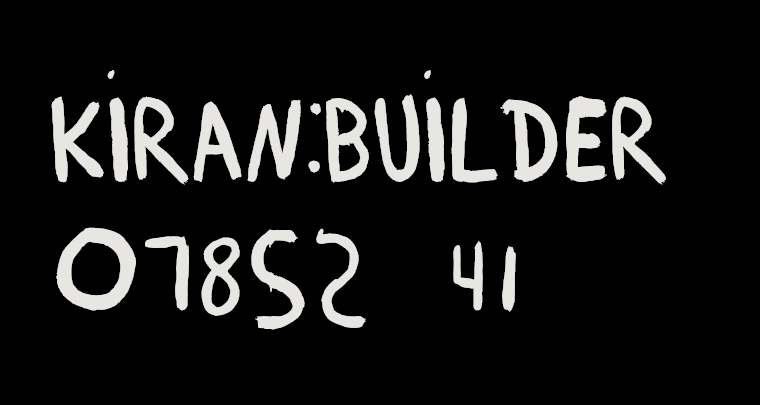

# Kiran Builder Typeface

Building a font from this image


Using <https://fontforge.org/>

## Commands

Required:

- <https://imagemagick.org/> (standard on Ubuntu)

### Invert quantized images

```bash
for image in $(find . -wholename "./reference/quantized_png/*.png"); do convert $image -channel RGB -negate ./reference/quantized_inverted_png/$(basename $image);
```

### Convert quantized images to bitmaps

```bash
for image in $(find . -wholename "./reference/quantized_inverted_png/*.png"); do convert $image ./reference/quantized_inverted_bmp/$(basename ${image%.*}).bmp; done
```

### Trace bitmaps with `potrace`

```bash
for image in $(find . -wholename "./reference/quantized_inverted_bmp/*"); do potrace --svg $image -o "./reference/traced/$(basename ${image%.*}).svg"; d
one
```

## Generate font

See <https://fontforge.org/docs/tutorial/editexample7.html>, but `Ctrl+Shift+G` in FontForge.

## Preview font

You can use <https://fontdrop.info/>, and upload [`kiranbuilder.woff`](./kiranbuilder.woff)


